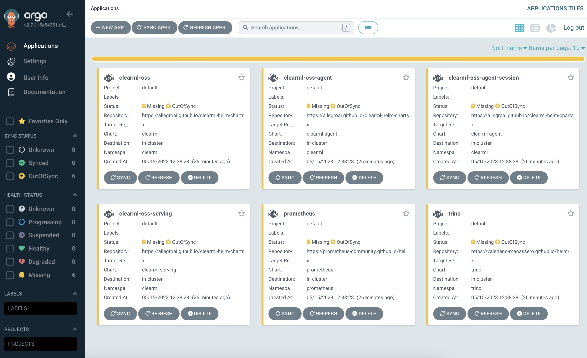

# Kubernetes Cluster GitOps development environment

This repository contains the Terraform code to create a Kubernetes cluster using [Kind](https://kind.sigs.k8s.io/).

ArgoCD is installed on the cluster to manage the GitOps repositories.

## Prerequisites

- [Terraform](https://www.terraform.io/downloads.html) >= 1.14.5
- [Kind](https://kind.sigs.k8s.io/) >= 0.18.0

## Cluster

### Creation

Eventually create a `terraform.tfvars` to override variables defined in `variables.tf`.

```bash
# Create a Kubernetes cluster using Terraform
terraform init
terraform apply
```

### Destroy

```bash
terraform destroy
```

## ArgoCD usage

ArgoCD is available after cluster bootstrap at http://argocd.127-0-0-1.nip.io" (or variable `argocd_hostname` if overridden).

User is `admin` with passowrd `admin` (or variable `argocd_password` if overridden).

Once logged in you will have some preconfigured application that can be created with a sync:



### Available preconfigured applications

* ClearML stack (Server, Agent, Serving) - https://clear.ml
* TrinoDB - https://trino.io
* Grafana stack (Grafana, Loki, Prometheus, Tempo ...) - https://grafana.com
* Opentelemetry operator - https://opentelemetry.io
* more coming...
